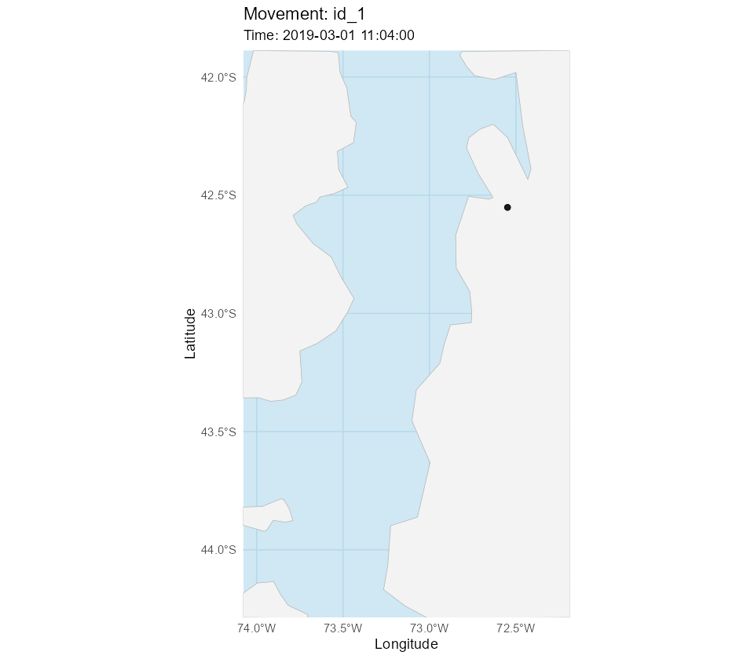
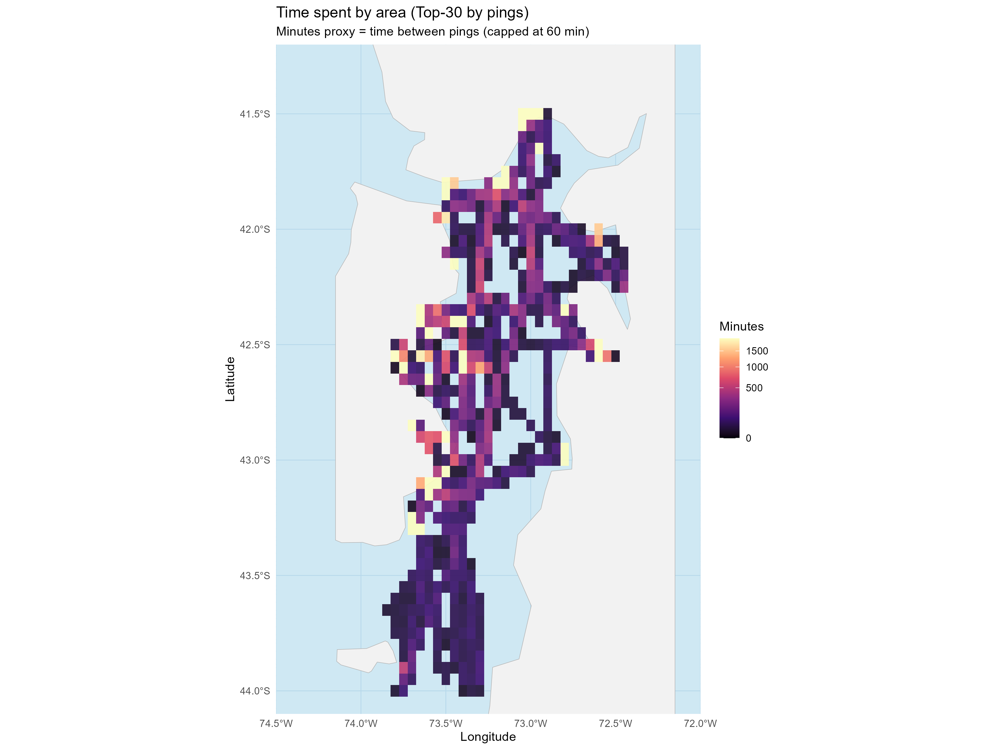
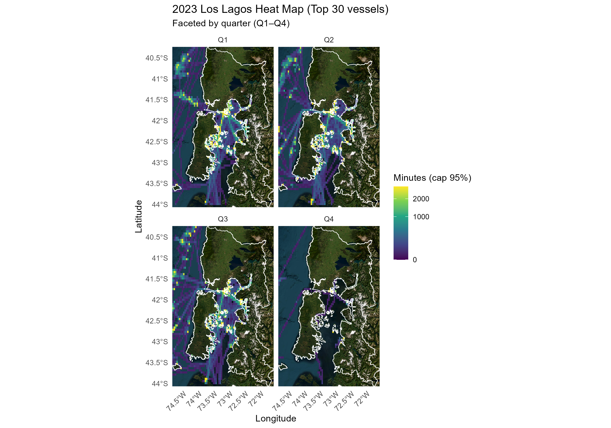

# Artisanal fishing behavior Chile

Pipeline to download SERNAPESCA (Chile’s National Fisheries and Aquaculture Service; Spanish acronym) satellite positioning CSV reports for artisanal fleets, build a DuckDB database, filter the Los Lagos region, and generate some fishing behavior proxies.

*⚠️ This pipeline is under active development and does not yet represent a final or fully stabilized version. The structure, outputs, and indicators may change as the project evolves.*

## Data source

Data are obtained from SERNAPESCA (Chile’s National Fisheries and Aquaculture Service), specifically from the
[*Geographic positions from the satellite positioning system*](https://www.sernapesca.cl/informacion-utilidad/posiciones-geograficas-del-sistema-de-posicionamiento-satelital/) webpage.  
The source is updated daily by SERNAPESCA. The download script is designed to be incremental: when executed, it automatically checks which files are already present locally and only downloads new reports that have not been previously retrieved.

## Repository structure

- `R/` — data pipeline scripts
- `data_raw/` — downloaded CSVs (not provided here)
- `data_processed/` — filtered outputs (not provided here)
- `outputs/` — figures and animations
- `assets/` — images used in this README

## How to run

1\. Open R and install packages (or use renv if added).

2\. Run:

   - `source("R/Fisheries_Webbscrapping.R")`

## Outcomes 

The following figures illustrate **some examples of the outputs that can be generated** using the downloaded and processed data, for example, including vessel movement patterns and time-use proxies.

 

 

