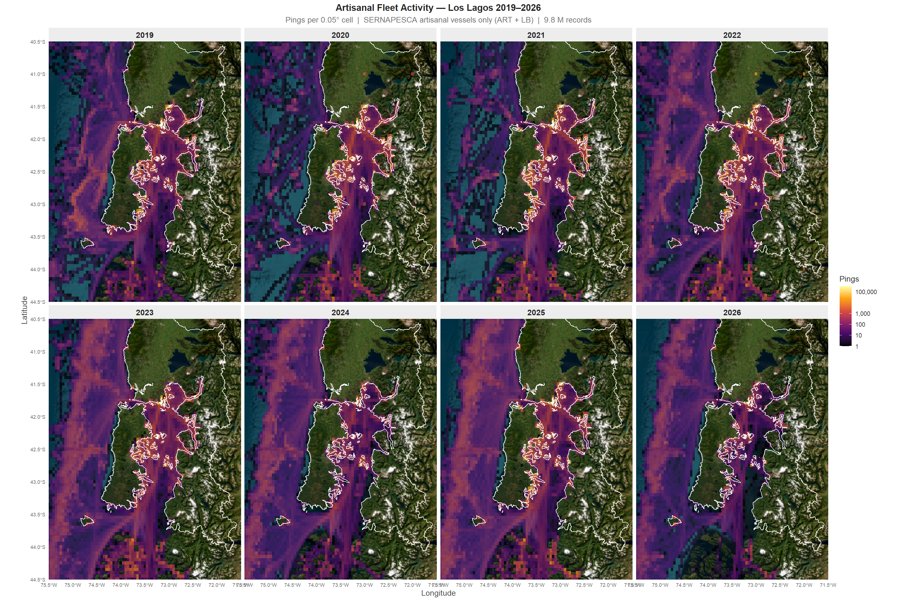
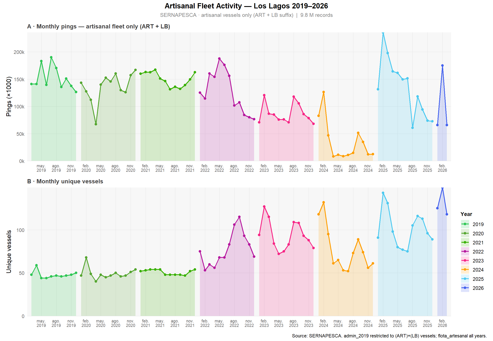
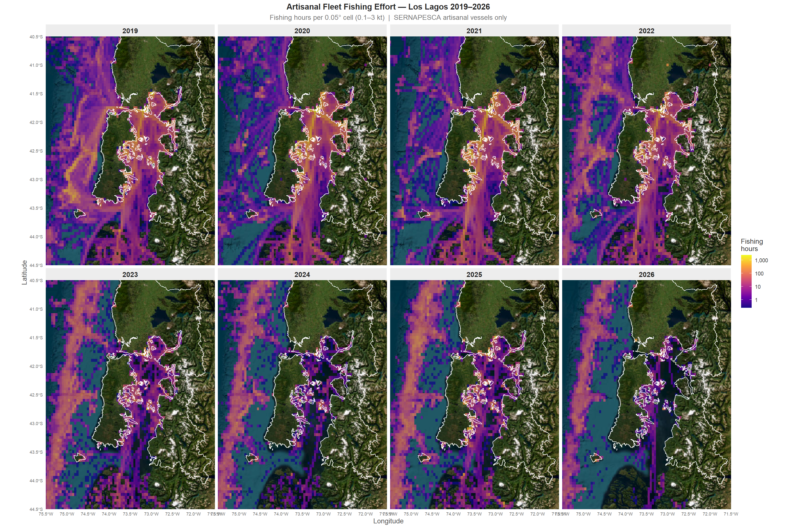

# Artisanal fishing behavior Chile

Pipeline to download SERNAPESCA (Chile’s National Fisheries and Aquaculture Service; Spanish acronym) satellite positioning CSV reports for artisanal fleets, build a DuckDB database, filter the Los Lagos region, and generate fishing behavior proxies including spatial effort maps.

*⚠️ This pipeline is under active development and does not yet represent a final or fully stabilized version. The structure, outputs, and indicators may change as the project evolves.*

## Data source

Data are obtained from SERNAPESCA (Chile’s National Fisheries and Aquaculture Service), specifically from the
[*Geographic positions from the satellite positioning system*](https://www.sernapesca.cl/informacion-utilidad/posiciones-geograficas-del-sistema-de-posicionamiento-satelital/) webpage.  
The source is updated daily by SERNAPESCA. The download script is designed to be incremental: when executed, it automatically checks which files are already present locally and only downloads new reports that have not been previously retrieved.

## Repository structure

- `R/` — data pipeline scripts
- `data_raw/` — downloaded CSVs (not provided here)
- `data_processed/` — filtered outputs (not provided here)
- `outputs/` — figures and animations
- `assets/` — images used in this README

## How to run

1\. Open R and install packages (or use renv if added).

2\. Run:

   - `source("R/Fisheries_Webbscrapping.R")`

## Outcomes 

The following figures illustrate **some examples of the outputs that can be generated** using the downloaded and processed data, including vessel movement patterns, time-use proxies, and fishing effort maps.

### Activity heatmap and time series

Ping density across the Los Lagos region (2019–2026), restricted to artisanal vessels (`(ART)` and `(LB)` suffixes only):

Monthly total pings and unique vessel counts over time:

### Fishing effort map

Spatial distribution of fishing effort (fishing hours per 0.05° grid cell) across Los Lagos 2019–2026:

#### Effort computation approach

Fishing effort is estimated using a **speed-threshold method**, a standard approach in VMS-based fisheries research ([Gerritsen & Lordan 2011](https://academic.oup.com/icesjms/article/68/1/245/628374); [Behivoke et al. 2021](https://www.sciencedirect.com/science/article/pii/S1470160X20312632)):

- A VMS ping is classified as **fishing** if vessel speed is between **0.1 and 3.0 knots**
- Pings below 0.1 kt are classified as **at anchor / moored**
- Pings above 3.0 kt are classified as **steaming / transiting**
- **Fishing hours** are computed as number of fishing-classified pings × 15 minutes (nominal SERNAPESCA reporting interval)
- Speed thresholds are calibrated for artisanal small-scale vessels following Behivoke et al. (2021), who show artisanal fishing speeds are substantially lower than industrial trawlers

#### Data consistency note

The dataset combines two SERNAPESCA report formats with different frequencies and vessel scope:

| Period | Source | Frequency | Vessels included |
|--------|--------|-----------|-----------------|
| 2019–mid 2022 | Admin snapshot reports | ~4 snapshots/day | All registered vessels (filtered here to artisanal only) |
| mid 2022–2026 | Daily artisanal fleet reports | 1 report/day | Artisanal vessels only |

To ensure comparability, 2019–2022 admin snapshots are restricted to vessels with `(ART)` (artesanal) and `(LB)` (lancha bote) suffixes (~74–163 vessels/year), consistent with the ~134–190 vessels in the post-2022 daily reports.

> **⚠️ Note on 2026 data:** The 2026 figures are **incomplete** — SERNAPESCA publishes reports daily, so the dataset currently covers January–March 2026 only. Totals for 2026 will grow as new daily reports are downloaded.

---

## References

Behivoke, F., Etienne, M.-P., Guitton, J., Randriatsara, R.M., Mahafina, J., & Léopold, M. (2021). Estimating fishing effort in small-scale fisheries using GPS tracking data and random forests. *Ecological Indicators*, 123, 107321. https://doi.org/10.1016/j.ecolind.2020.107321

Gerritsen, H., & Lordan, C. (2011). Integrating vessel monitoring systems (VMS) data with daily catch data from logbooks to explore the spatial distribution of catch and effort at high resolution. *ICES Journal of Marine Science*, 68(1), 245–252. https://doi.org/10.1093/icesjms/fsq137

